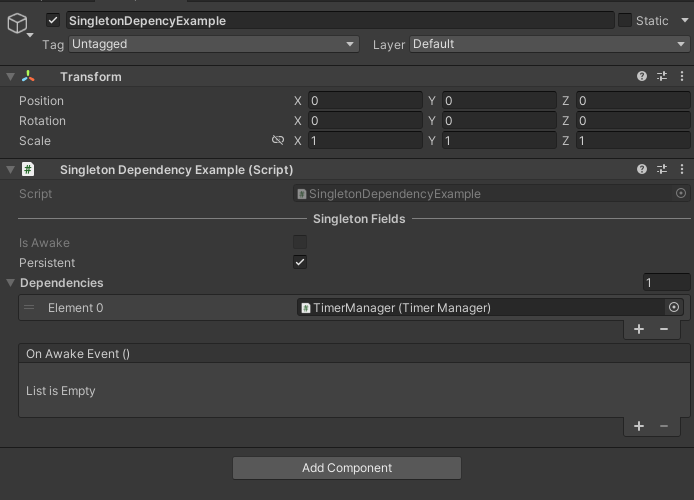
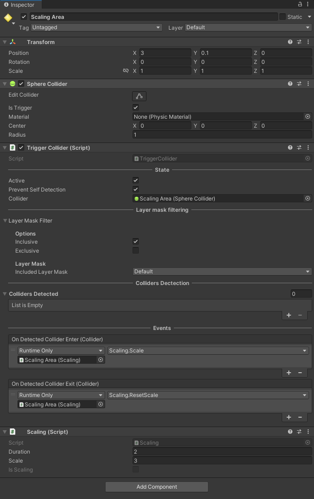

# Getting Started #

## Runtime ##

To access all the extension methods, import the library at the top of your script.
```cs
using TetraCreations.Core;
```

To access all utility scripts :
```cs
using TetraCreations.Core.Utility;
```
Which include :
- A generic Singleton pattern implementation.
- A `TimerManager` to create and run every timer in a single Update method.
- A simple `TriggerCollider` script to detect Rigidbodies entering/exiting a trigger collider.
- An example how to manage audio settings, using the `AudioManager` component to generate volume sliders at runtime.
- `FloatValueCondition` to evaluate if a float value is Lower, Greater, Equals or Between other values to trigger methods from different scripts.


## Editor ##

```cs
using TetraCreations.Core.Editor;
```

Then you can access to :
- AssetDatabaseExtensions :
    - Get assets by their type inside one or multiple folders.
    - Verify if an asset exist.
    - Create asset at a specific path.
    - Verify path and asset name before creation.
- AudioMixerExtensions :
    - Get the list of exposed parameters
- MonoScriptExtensions :
    - Create scriptable object instance using the reference of the MonoScript.
- PathReferenceExtensions :
    - Extend `PathReference` from `TetraAttributes` to create/load/delete/count assets directly from the folder reference.

> [!WARNING]
> Remember that you need to move all your editor scripts to an Editor folder or to use **#if UNITY_EDITOR / #endif** otherwise your build will not compile !

---

# Extensions examples #

## 1. AudioMixer ##

A recurring issue in Unity is managing the audio settings using an `AudioMixer` we can expose volume parameter. However its a floating number representing the sound level in decibel. To modify it using a slider from the UI, we have to convert the linear value to a decibel value. That's why I've got an audio mixer extension method that does the conversion automatically :
```cs
AudioMixer.SetLinearVolume("MusicVolume", 0.8f);
```
The first parameter is the name of the Exposed Parameter from the `AudioMixer`.
The second parameter is the linear volume value, here 0.8f is equals to -1.94 dB.
The third parameter determine if we clamp the linear volume to not exceed the safe audio limit in decibel which is defined as -80 dB to +0 dB, it is set to true by default.

See the `AudioManager` example scene for more details.

---

## 2. Canvas Group ##

There is plenty of extensions methods which makes the code easier to read and avoid repetition, another example is how to show or hide UI elements using `CanvasGroup`.

```cs
/// <summary>
/// Show a canvas group while blocking raycasts
/// </summary>
/// <param name="canvasGroup"></param>
public static void Show(this CanvasGroup canvasGroup)
{
    canvasGroup.alpha = 1;
    canvasGroup.blocksRaycasts = true;
}

/// <summary>
/// Hide a canvas group while disable blocking raycasts
/// </summary>
/// <param name="canvasGroup"></param>
public static void Hide(this CanvasGroup canvasGroup)
{
    canvasGroup.alpha = 0;
    canvasGroup.blocksRaycasts = false;  
}
```
This is something I do all the time in every project.<br>
Its recommended instead the using `CanvasGroup` instead of enabling/disabling the entire gameObject which is generally more costly.

---

## 3. List ##

You can find few examples inside the package, a common one is list and collection extensions

```cs
_numbers = new List<int>{ 1, 2, 3, 4, 5, 6, 7, 8, 9, 10 };

// Shuffle all elements using Fisher-Yates algorithm which produces an unbiased permutation
_numbers.Shuffle();

// Debug.Log all elements
Debug.Log("Numbers : ");
_numbers.Log();

// Add an element if it's not already in the list
_numbers.AddItNotContains(5);

// Loop backwards
Debug.Log("Reverse loop : ");
foreach(var number in _numbers.ReverseLoop())
{
    Debug.Log(number);
}

// Adding existing numbers
_numbers.AddRange(new List<int> { 1,5,8 });

// Determine if the list contains unique elements
Debug.Log("Contains unique elements : " + _numbers.HasUniqueElements());

// Create a new list without the duplicates
var withoutDuplicates = _numbers.RemoveDuplicates();

Debug.Log("Wihout duplicates : ");
withoutDuplicates.Log();
```

---

# Utilities examples #

## 1. Generic Singleton Pattern ##

To change any `MonoBehaviour` script to a `Singleton` simply extend from Singleton\<T> where T is the type of your script.

For example I have a Singleton to manage all timers in my game
```cs
public class TimerManager : Singleton<TimerManager>
{
  [Title("Active Timer")]
  [SerializeField] [ReadOnly] private bool _hasTimers = false;
  [SerializeField] [ReadOnly] private int _activeTimerCount = 0;
  [SerializeField] [ReadOnly] private List<CountdownTimer> _activeTimers;

  protected override void OnAwake()
  {
    base.OnAwake();

    _activeTimers = new List<CountdownTimer>();
  }
}
```

The import thing to notice is the override of the `OnAwake()` method, by default all `MonoBehaviour` use `Awake()` when the scene start.

However, the generic abstract class Singleton already call `Awake()` to initialize itself, it checks for duplicates instances in the current scene, then it calls a protected virtual method `OnAwake()` that you can override, if you call `Awake()` instead then the Singleton wont be
initialized and it will not work.

When using the Singleton pattern, one common issue is trying to call a method from the Singleton inside the Awake method of another Singleton,
we don't know which one is initialized first. To avoid dealing with script execution order, we can the other script as a dependency inside the inspector.
In the example screen below it will wait until `TimerManager` is initialized.



---

## 2. AssetDatabase ##

Inside Editors or Scriptable Object I often need to load assets, lets imagine that I have imported 200 Sprites in my project, and I want to create a scriptable object foreach one of them an directly assign the sprite on it.

> [!WARNING]
> Remember that you need to move all your editor scripts to an Editor folder or to use **#if UNITY_EDITOR / #endif** otherwise your build will not compile !

I can use the `AssetDataExtensions` to load every sprites from a specific folder:


```cs
var spritesPath = "Assets/Example/Sprites";
var sprites = AssetDatabaseExtensions.GetAssetsFrom<Sprite>(new string[]{ spritesPath });

foreach (var sprite in sprites)
{
    /// Do something with each sprite
}
```

Using `PathReference` class from `TetraAttributes` makes it even easier :
```cs
[SerializeField] private PathReference _audioClipFolder;

void LoadAudioClip()
{
    // We could also use the GetAssets<T>() extension method directly from the PathReference, which does the same thing.
    var audioClips = _audioClipFolder.GetAssets<AudioClip>();

    foreach(var audioClip in audioClips)
    {
        /// Do something with each sprite
    }
}
```
Without extensions method the code to get assets is not generic and can be difficult to remember :

```cs
var assets = AssetDatabase.FindAssets($"t:sprite", new string[] { folderPath }.ToList()
    .Select(AssetDatabase.GUIDToAssetPath)
    .Select(AssetDatabase.LoadAssetAtPath<Sprite>)
    .ToList());
```

Using a generic method accepting any `UnityEngine.Object` is extremely useful.

We can also load an asset by its name, this however will search in the entire AssetDatase as we don't specify a folder.

---

## 3. Trigger Collider ##

Lets start with something very simple and useful in any project, `TriggerCollider` is a component to detect colliders, depending on their layers. It is used to call methods from other scripts by invoking `OnDetectedColliderEnter` and `OnDetectedColliderExist` events.

> [!NOTE]
> Inactive GameObject in the scene are not detected.



In this example, I have setup a `GameObject` with a `Sphere Collider` set as a `Trigger`.
When other GameObjects with `Rigidbody` enters it, a method is called using the event `OnDetectedColliderEnter` to change the local scale of the object use Scaling script. When exiting the `Trigger` the scale is reset back to 1f.

You can use `Trigger2DCollider` for 2D projects, you can also create your own component using `TriggerCollider` as base class, then overriding the `Enter` and `Exit` methods if you need to add your own filtering system.

I didn't made a `Tag` filtering system because I personally don't like string comparison.

---

## 4. Float Value Condition ##

Calling multiple methods from different scripts when a float value reach a particular value is very common. For example we may play sound effect and turn the screen overlay to red when the player health drop below a certain percentage.

This is done using the `FloatValueCondition` class, which evaluate if the condition is met when the health value change.

Using events, components are decoupled and we can re-use `FloatValueCondition` is many scenario.


`FloatValueConditionExample` will verify if the value is lower or equals than 0.3 which represent the percentage of health of the player.

`RaiseEventOnce` means that if the condition is already met and the player health drop again below 0.3f, we are not going to raise the event again, because the condition is still true.

We set `ResetEventRaisedWhenNotMet` to true, so we the player health percentage goes above 0.3f, we want to raise the event if it drops again below 0.3f.

By setting the `ConditonType` to `Equals`, we can specify the equality precision since we are using floating number for example we may consider 99.96 to be equals to 100.

---

## 5. Timer Manager ##

We often need to raise an event after some time is elapsed by using Coroutine with WaitForSeconds or by incrementing a timer in the Update method of a `MonoBehaviour`.

This is why I created two simple class `Timer` and `CountdownTimer` responsible for this.
They are plain C# classes, they depends on the `TimerManager` to be started and to update their time.

Here is an example on how to prevent the player from spamming an attack with his character :


```cs

[SerializeField] private Animator _animator;
[SerializeField] private Button _attackButton;
[SerializeField] private CountdownTimerUI _countdownTimerUI;
[SerializeField] private float _attackRate;
[SerializeField] private bool _autoAttack;

private CountdownTimer _countdownTimer;

public bool IsOnCooldown => _countdownTimer.IsRunning;

public CountdownTimer CountdownTimer { get => _countdownTimer; protected set => _countdownTimer = value; }

private void Start()
{
    _countdownTimer = new CountdownTimer(_attackRate, loop: _autoAttack);

    _countdownTimerUI.Initialize(_countdownTimer);

    // We have to manually click on the button to Start the timer
    _countdownTimer.OnTimerStart += DisableAttackButton;
    _countdownTimer.OnTimerStop += EnableAttackButton;
}

// This is called when clicking the 'Attack' button
public void Attack()
{
    if (IsOnCooldown) { return; }

    TimerManager.Instance.StartTimer(_countdownTimer);

    _animator.SetTrigger("Attack");
}

private void AutoAttack()
{
    _animator.SetTrigger("Attack");
}

private void DisableAttackButton()
{
    _attackButton.interactable = false;
}

private void EnableAttackButton()
{
    _attackButton.interactable = true;
}
```

When the `CountdownTimer` start we disable the attack button and enable it when the timer stops.

We call `TimerManager.Instance.StartTimer` to add our countdown timer has an active timer,
the `TimerManager` will update every single timer every frame, its more efficient than using one `MonoBehaviour` per timer.

Here the countdown timer start with the initial time 2f (the attack rate) and stops automatically when its time reach 0.

We can also set the `AutoAttack` to true so the timer will loop forever, the event `OnTimerLooped` will be raise and our character will perform the attack animation.

We have to change the start method to use the AutoAttack system :
```cs
private void Start()
{
    _countdownTimer = new CountdownTimer(_attackRate, loop: _autoAttack);

    _countdownTimerUI.Initialize(_countdownTimer);

    if (_autoAttack)
    {
        DisableAttackButton();

        // Every time the count down timer is done it will reset and start again automatically
        _countdownTimer.OnTimerLooped += AutoAttack;

        // Perform the attack, start the count down timer
        _attackButton.onClick.Invoke();
        TimerManager.Instance.StartTimer(_countdownTimer);
        return;
    }

    // We have to manually click on the button to Start the timer
    _countdownTimer.OnTimerStart += DisableAttackButton;
    _countdownTimer.OnTimerStop += EnableAttackButton;
}
```
We don't need to use the Button, and we start the timer only once, it will stay inside the `TimerManager` and loop forever.

Lets see how we update the UI to display the remaining time of the timer and to update the progress bar.

```cs
[Header("Update Text/Progress Bar")]
[SerializeField] private bool _enableTextUpdate = true;
[SerializeField] private bool _changeTextInUpdateMethod = true;
[SerializeField] private bool _enableProgressBarUpdate = true;

[Header("References")]
[SerializeField] private TextMeshProUGUI _timeInSeconds;
[SerializeField] private Image _progressBarImage;

[Header("Countdown Timer")]
[SerializeField] private CountdownTimer _countdownTimer;

public bool ChangeTextInUpdateMethod { get => _changeTextInUpdateMethod; set => _changeTextInUpdateMethod = value; }
public bool EnableTextUpdate { get => _enableTextUpdate; set => _enableTextUpdate = value; }
public bool EnableProgressBarUpdate { get => _enableProgressBarUpdate; set => _enableProgressBarUpdate = value; }

public void Initialize(CountdownTimer countdownTimer)
{
    _countdownTimer = countdownTimer;

    /* Normally we verify if the TextMeshProUGUI and Image are set */

    if (_enableTextUpdate)
    {
        // We use the countdown timer event to update the text value every second instead of every frame
        if (_changeTextInUpdateMethod == false)
        {
            // We don't need any decimal because we display the time in second
            _countdownTimer.TimeFormat = "F0";
            _countdownTimer.OnSecondElapsed += UpdateText;
        }

        _timeInSeconds.text = _countdownTimer.TimeAsString;
        _countdownTimer.OnTimerStop += UpdateText;
    }

    if (_enableProgressBarUpdate)
    {
        _countdownTimer.OnTimerStop += UpdateProgressBar;
    }
}

/// <summary>
/// Set the text value using the current Time left on the countdown timer.
/// </summary>
public void UpdateText()
{
    if(EnableTextUpdate == false) { return; }

    _timeInSeconds.text = _countdownTimer.TimeAsString;
}

/// <summary>
/// Set the fill amount of the progress bar image using the current Progress on the countdown timer.
/// </summary>
public void UpdateProgressBar()
{
    if(EnableProgressBarUpdate == false) { return; }

    _progressBarImage.fillAmount = _countdownTimer.Progress;
}

private void Update()
{
    if (_changeTextInUpdateMethod)
    {
        UpdateText();
    }

    UpdateProgressBar();
}
```

Here we can either update the text to display the time left in the update method, however this runs every frame. Instead we can set `_changeTextInUpdateMethod` to false, to use the `OnSecondElapsed` event to update it every second.
